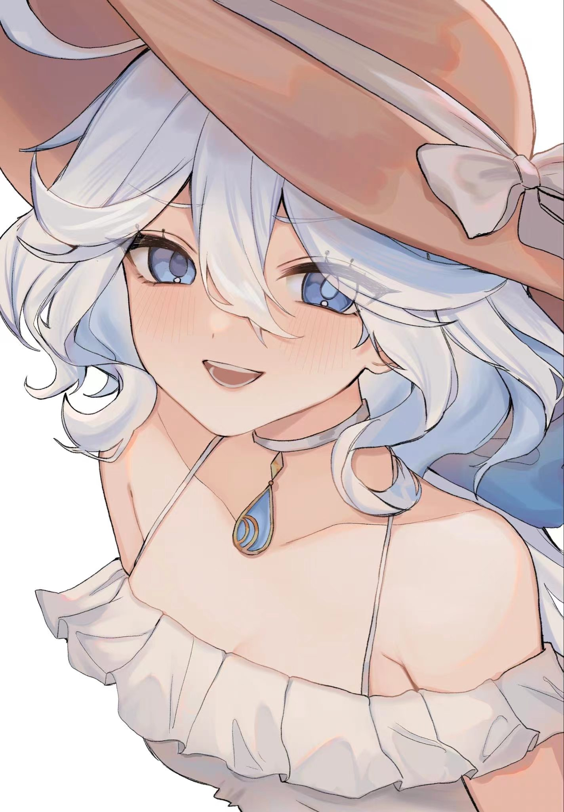

## Hi there 👋

<!-- 头像区域：添加圆角和轻微阴影，提升精致感 -->

<h3 style="margin: 12px 0; color: #2c3e50;">A learner on the way to IC & Embedded Engineering 🚀</h3>

Shenzhen Technology University | Genshin Impact Enthusiast

📌 About Me

<ul style="list-style: none; padding: 0; line-height: 1.8; color: #34495e;">
  
<li>🔭 <strong>Working at</strong>: Shenzhen Technology University</li>
<li>🌱 <strong>Learning</strong>: ysyx, STM32 SCM, ACM Algorithm</li>
<li>🤔 <strong>Focus on</strong>: Integrated Circuit (IC) Design & Development</li>
<li>📫 <strong>Reach me</strong>: <a href="mailto:1145676148@qq.com" style="color: #3498db; text-decoration: none;">1145676148@qq.com</a></li>
<li>🎮 <strong>Games I play</strong>: Genshin Impact, Hollow Knight: Silksong, Valorant</li>
</ul>

